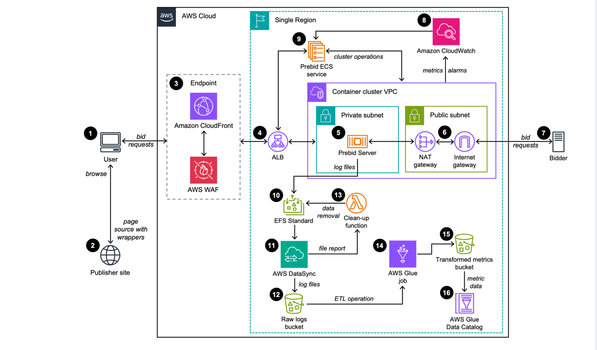

# Prebid Server Deployment on AWS

This solution deploys v3.13.0 of [Prebid Server Java](https://github.com/prebid/prebid-server-java.git) with infrastructure in a single region of the AWS Cloud to handle a wide range of request traffic, and recording of auction and bid transaction data.

## Architecture 

The following image shows the top-level architecture of the Prebid Server Deployment on AWS.



**Note**: From v1.0.0, AWS CloudFormation template resources are created by the [AWS CDK](https://aws.amazon.com/cdk/) 
and [AWS Solutions Constructs](https://aws.amazon.com/solutions/constructs/). 

### AWS CDK Constructs 

[AWS CDK Solutions Constructs](https://aws.amazon.com/solutions/constructs/) make it easier to consistently create
well-architected applications. All AWS Solutions Constructs are reviewed by AWS and use best practices established by 
the AWS Well-Architected Framework. 

## Deployment

You can launch this solution with one click from the AWS Solutions [landing page](https://aws.amazon.com/solutions/implementations/prebid-server-deployment-on-aws/). 

To customize the solution, or to contribute to the solution, see [Creating a custom build](#creating-a-custom-build)


## Creating a custom build 
To customize the solution, follow the steps below: 

### Prerequisites
The following procedures assumes that all the OS-level configuration has been completed. They are:

* [AWS Command Line Interface](https://aws.amazon.com/cli/)
* [Python](https://www.python.org/) 3.11 or newer
* [Pypi/Pip](https://pypi.org/project/pip/) 25.0 or newer
* [Poetry](https://python-poetry.org/docs/#installing-with-pipx) 2.0 or newer
* [Node.js](https://nodejs.org/en/) 16.x or newer 
* [AWS CDK](https://aws.amazon.com/cdk/) 2.140.0 or newer 
* [Amazon Corretto OpenJDK](https://docs.aws.amazon.com/corretto/) 21
* [Apache Maven](https://maven.apache.org/) 3.9.9
* [Docker](https://docs.docker.com/engine/)
* [AWS access key ID and secret access key](https://docs.aws.amazon.com/IAM/latest/UserGuide/id_credentials_access-keys.html) configured in your environment with AdministratorAccess equivalent permissions

> **Please ensure you test the templates before updating any production deployments.**

### 1. Download or clone this repo
```
git clone https://github.com/aws-solutions/prebid-server-deployment-on-aws.git
```

### 2. Create a Python virtual environment for development 
```bash 
cd prebid-server-deployment-on-aws
python3 -m venv .venv 
source ./.venv/bin/activate 
cd ./source 
pip install -r requirements-poetry.txt
poetry install
```

### 2. After introducing changes, run the unit tests to make sure the customizations don't break existing functionality
```bash
sh ../deployment/run-unit-tests.sh --in-venv 1
```

### 3. Build the solution for deployment

#### Prebid Server Container Image
By default, the Prebid Server container image will be built locally using Docker ([README](deployment/ecr/prebid-server/README.md)). If you prefer to use a remote image (from ECR or Docker Hub), set the following environment variable with your fully qualified image name before building the template:

```bash
export OVERRIDE_ECR_REGISTRY=your-fully-qualified-image-name
```

#### Using AWS CDK (recommended) 
Packaging and deploying the solution with the AWS CDK allows for the most flexibility in development
```bash 
cd ./infrastructure 

# set environment variables required by the solution
export BUCKET_NAME="my-bucket-name"

# bootstrap CDK (required once - deploys a CDK bootstrap CloudFormation stack for assets)  
cdk bootstrap --cloudformation-execution-policies arn:aws:iam::aws:policy/AdministratorAccess

# build the solution 
cdk synth

# build and deploy the solution 
cdk deploy
```

#### Using the solution build tools 
It is highly recommended to use the AWS CDK to deploy this solution (using the instructions above). While CDK is used to
develop the solution, to package the solution for release as a CloudFormation template, use the `build-s3-cdk-dist`
build tool: 

```bash
cd ./deployment

export DIST_BUCKET_PREFIX=my-bucket-name  
export SOLUTION_NAME=my-solution-name  
export VERSION=my-version  
export REGION_NAME=my-region
export OVERRIDE_ECR_REGISTRY=my-ecr-registry

build-s3-cdk-dist deploy \
  --source-bucket-name $DIST_BUCKET_PREFIX \
  --solution-name $SOLUTION_NAME \
  --version_code $VERSION \
  --cdk-app-path ../source/infrastructure/app.py \
  --cdk-app-entrypoint app:build_app \
  --region $REGION_NAME \
  --sync
```

**Parameter Details**
- `$DIST_BUCKET_PREFIX` - The S3 bucket name prefix. A randomized value is recommended. You will need to create an 
  S3 bucket where the name is `<DIST_BUCKET_PREFIX>-<REGION_NAME>`. The solution's CloudFormation template will expect the
  source code to be located in the bucket matching that name.
- `$SOLUTION_NAME` - The name of This solution (example: solution-customization)
- `$VERSION` - The version number to use (example: v0.0.1)
- `$REGION_NAME` - The region name to use (example: us-east-1)
- `$OVERRIDE_ECR_REGISTRY` - The ecr-registry to use (example: public.ecr.aws/abc12345/prebid-server:latest)

This will result in all global assets being pushed to the `DIST_BUCKET_PREFIX`, and all regional assets being pushed to 
`DIST_BUCKET_PREFIX-<REGION_NAME>`. If your `REGION_NAME` is us-east-1, and the `DIST_BUCKET_PREFIX` is
`my-bucket-name`, ensure that both `my-bucket-name` and `my-bucket-name-us-east-1` exist and are owned by you. 

After running the command, you can deploy the template:

* Get the link of the `SOLUTION_NAME.template` uploaded to your Amazon S3 bucket
* Deploy the solution to your account by launching a new AWS CloudFormation stack using the link of the template above.

> **Note:** `build-s3-cdk-dist` will use your current configured `AWS_REGION` and `AWS_PROFILE`. To set your defaults, install the [AWS Command Line Interface](https://aws.amazon.com/cli/) and run `aws configure`.

> **Note:** You can drop `--sync` from the command to only perform the build and synthesis of the template without uploading to a remote location. This is helpful when testing new changes to the code.

## Prebid Server Java Container Customization

You may choose to customize the container configuration, or create your own container to use with this solution. The infrastructure for this solution has only been tested on Prebid Server Java.

#### Deploy with Customized Prebid Server Configurations
* After deploying the CloudFormation template stack, find the S3 bucket in the CloudFormation stack outputs named `ContainerImagePrebidSolutionConfigBucket`.
1. Review the `/prebid-server/default/README.md` and `/prebid-server/current/README.md` files in the bucket.
2. Upload your changes to the `/prebid-server/current/` prefix in that bucket.
3. To update the ECS service manually, navigate to the Amazon ECS cluster associated with the deployed CloudFormation stack using the AWS Management Console. Then, update the ECS service by selecting the 'Force New Deployment' option with the new task definition version, as described in the official AWS documentation for updating an ECS service via the console. [ref](https://docs.aws.amazon.com/AmazonECS/latest/developerguide/update-service-console-v2.html).[ref](https://docs.aws.amazon.com/AmazonECS/latest/developerguide/update-service-console-v2.html).

### Runtime and Metric Logging for ETL

The Prebid Server container shipped with this solution is configured for two types of logging.

Runtime logs from the Prebid Server are sent to CloudWatch logs under the `PrebidContainerLogGroup` log group. This log group collects runtime logs for all containers and includes the container ID from ECS. Container logs are available to use with CloudWatch Log Insights and Live Tailing.

Review the file named `deployment/ecr/prebid-server/prebid-logging.xml` for the required locations of log file output. Resources outside of the containers instances, including Lambda Functions and AWS DataSync jobs, expect to find log files at the following locations.

* `/mnt/efs/metrics/CONTAINER_ID/prebid-metrics.log` is where the current metrics output log is written. The default interval for outputting metrics to this file is 30 seconds.
* `/mnt/efs/metrics/CONTAINER_ID/archived/prebid-metrics.TIMESTAMP.log.gz`is where logs are rotated on a schedule. This location is scanned by AWS DataSync periodically to migrate logs from EFS to S3 for the ETL process to AWS Glue Catalog. Rotated logs are removed from EFS after migration to S3.

The value for `CONTAINER_ID` and `TIMESTAMP` is available within the logging environment and is used in the `prebid-logging.xml` configuration file.

### Container Hosting and Deploy

To build a different **version** of Prebid Server Java using this solution:
* Review the release tags on the Prebid Server Java public repository
* Update the file `deployment/ecr/prebid-server/config.json` with the version of Prebid Server Java you want to use (version numbers are in the format MAJOR.MINOR.PATCH)
* Build the solution, host it in one or more S3 buckets, and deploy using the process described earlier in the README

If you'd like to use a different container:
* Build and host your new container image in ECR or Docker Hub
* Copy the complete URI, including the tag, for your new container
* Build and host the solution assets for installation in your account using the process described above
* Change to the `deployment/global-s3-assets` folder on the build workstation
* Open the file `prebid-server-deployment-on-aws.template` in an editor
* Find the line in the template under the Task Definition resource that is `"Image": "public.ecr.aws/aws-solutions/prebid-server:v1.1.3",`
* Update the Image property value with your container image URI
* Create the stack by uploading the changed template to the CloudFormation console

You can host the updated template in a bucket of your choosing or place the updated template in your organization's storage or source repository.


## Collection of operational metrics
This solution collects anonymized operational metrics to help AWS improve the quality of features of the solution.
For more information, including how to disable this capability, please see the [implementation guide](https://docs.aws.amazon.com/solutions/latest/prebid-server-deployment-on-aws/anonymized-data-collection.html).
 
***

Copyright Amazon.com, Inc. or its affiliates. All Rights Reserved.

Licensed under the Apache License, Version 2.0 (the "License");
you may not use this file except in compliance with the License.
You may obtain a copy of the License at

    http://www.apache.org/licenses/LICENSE-2.0

Unless required by applicable law or agreed to in writing, software
distributed under the License is distributed on an "AS IS" BASIS,
WITHOUT WARRANTIES OR CONDITIONS OF ANY KIND, either express or implied.
See the License for the specific language governing permissions and
limitations under the License.
